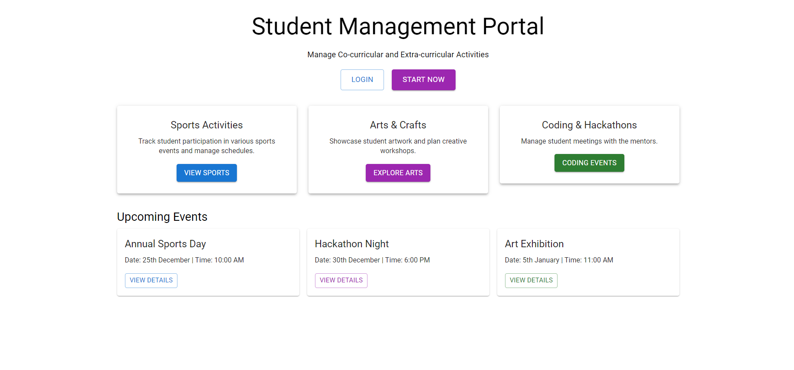
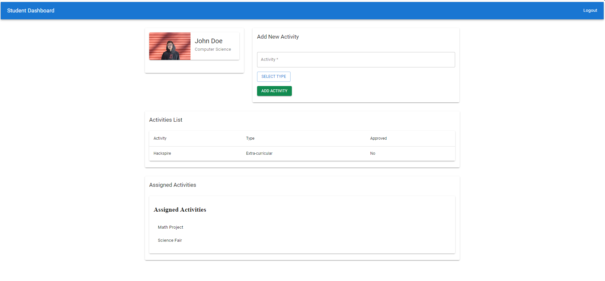
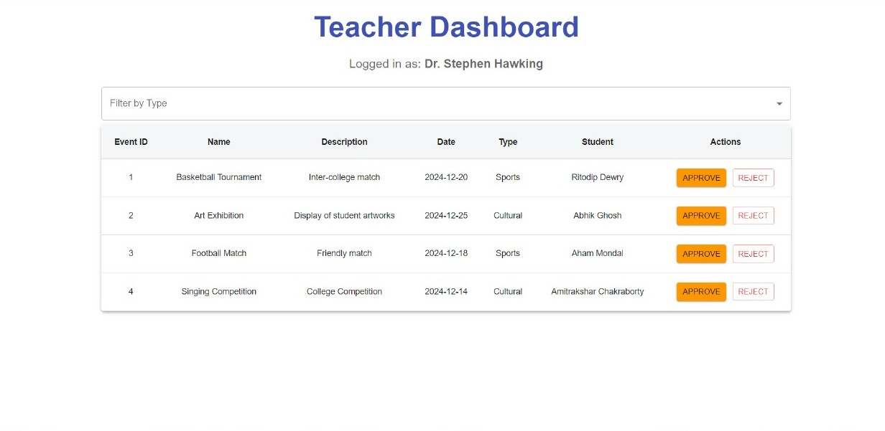

# Student Activity Management Portal

The **Student Activity Management Portal** is an online platform designed to allow students to record their participation in both curricular and non-curricular activities. The portal will assign points based on student involvement and allow administrators to track engagement. The portal aims to provide an easy and efficient way to recognize and reward student participation.

---

## Features

- **Student Dashboard**: View and track participation in activities.
- **Activity Categories**: Log curricular and non-curricular activities.
- **Point Allocation**: Points are assigned based on the type and level of participation.
- **Admin Panel** (Coming Soon): Administrators will manage activities, set point values, and monitor student progress.

---

## UI Overview

The User Interface (UI) for the portal is designed and developed, providing a functional and engaging experience for both students and administrators. Currently, only the front-end (UI) section has been completed, and the backend is under development.

### Student Dashboard

- Students can view their activity history, points earned, and activities.
- [Insert screenshot or UI image here]

### Activity Submission

- Home Page of the student activity management system
  
- Students can submit their participation in activities and categorize them as curricular or non-curricular.
- 
- Teacher can check the student submission and approve them.
- 

---

## Installation

The current version only includes the frontend UI. To set up and run the frontend part of the portal locally, follow these steps:

### Prerequisites

- Node.js
- npm (Node Package Manager)

### Steps

1. Clone the repository:
   ```bash
   git clone https://github.com/Abhik4004/Student-Activity-Management-Portal.git
   ```
2. Navigate to the project directory:
   ```bash
   cd student-activity-management-portal
   ```
3. Install dependencies:
   ```bash
   npm install
   ```
4. Start the frontend:
   ```bash
   npm start
   ```
5. Open your browser and go to `http://localhost:5173` to view the portal.

## Backend (Coming Soon)

The backend for the portal is currently under development. Once the backend is complete, it will allow for:

- Storing activity data in a database.
- Point allocation based on activity participation.
- Admin functionality for managing activity categories and points.
